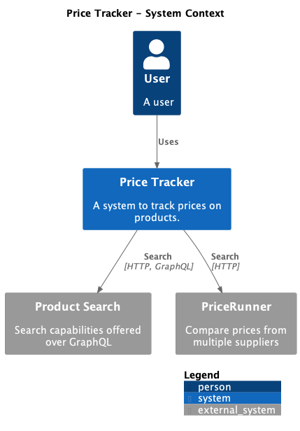
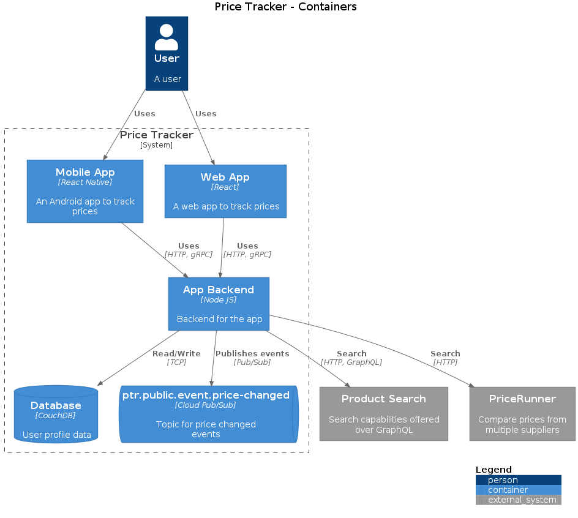

# structurizr-to-png

Create PNGs from [Structurizr DSL](https://github.com/structurizr/dsl#readme) files.

This project uses [PlantUML](https://plantuml.com) and the [C4-PlantUML macros](https://github.com/plantuml-stdlib/C4-PlantUML)
to render Structurizr DSL to PNG images. It performs some post-processing of the workspace model to support conventions around external software systems.

  * Tags are mapped to shapes in the [`theme.json`](./src/main/resources/themes/theme.json)
  * Systems tagged with `External`, `External System` or `Existing System` will be rendered as external

## Features

  * Create PNGs from DSL files
  * Live preview of PNGs in your browser

The [examples](#examples) section showcases the output from the tool.

# Usage

The project is intended to be used locally while authoring diagrams and in build pipelines workflows to automatically update diagrams in the source repository and READMEs.

## :rocket: Helper scripts

The easiest way to get started with the project is to create a helper script. If using bash, create the following script and name it `dsl2png.sh`.

```bash
#!/bin/sh
set -e
docker pull --quiet extenda/structurizr-to-png
exec docker run --rm -it -v "$(pwd)":/docs -p 3000:3000 extenda/structurizr-to-png "$@"

```

Or, if you're using Windows, create `dsl2png.cmd`.

```cmd
@echo off
docker pull --quiet extenda/structurizr-to-png
docker run --rm -it -v "%CD%":/docs -p 3000:3000 extenda/structurizr-to-png %*
```

With these scripts, users will be upgraded to the latest available version and also don't need to remember the lengthly docker command. To watch a directory for changes to DSL files, simply run:

```bash
./dsl2png.sh --watch
```

## :whale: Docker

```bash
$ docker run --rm -it -v $(pwd):/docs extenda/structurizr-to-png
```

The convention is to generate diagrams to an `images/` directory inside the working directory. The default working directory used in the container is `/docs`. The above command will render all `*.dsl` files in the current working directory and it's subdirectories.

To render particular dsl files, use the `--path` option (glob is supported). Relative paths are treated from DSL file directory.

```bash
$ docker run --rm -it -v $(pwd):/docs extenda/structurizr-to-png --path workspace.ecd.dsl
```

To change the default output location, use the `--output` option. If specified as a relative path, it is resolved from DSL file directory.

```bash
$ docker run --rm -it -v $(pwd):/docs extenda/structurizr-to-png --output c4-diagrams
```

The above example will write files to the `c4-diagrams` directory in the current working directory.

### Live preview in browser

To use the live preview functionality, we must add the `--watch` flag and a port binding.

```bash
$ docker run --rm -it -v $(pwd):/docs -p 3000:3000 extenda/structurizr-to-png --watch
```

Open https://localhost:3000 in your browser to see the preview images. The images will update when the DSL is changed.

# Examples

The examples are created from [demo.dsl](demo.dsl).

## System context



## Containers


# Development

  * The project is built with Java 17 and Maven.
    * `mvn verify` to build and run all tests
    * `java -jar target/structurizr-to-png.jar` runs the client on your local machine
  * Running locally requires Graphviz
  * Make sure to install [pre-commit](https://pre-commit.com) hooks and use them
  ```bash
  pre-commit install -t pre-commit -t commit-msg
  ```
  * Commit messages must follow [conventional commits](https://conventionalcommits.org)
  * [SonarCloud](https://sonarcloud.io/dashboard?id=extenda_structurizr-to-png)
    quality gates must pass for all pull requests

# :balance_scale: License

This project is licensed under the [MIT license](LICENSE).
