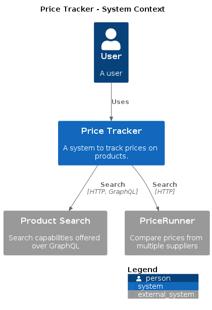
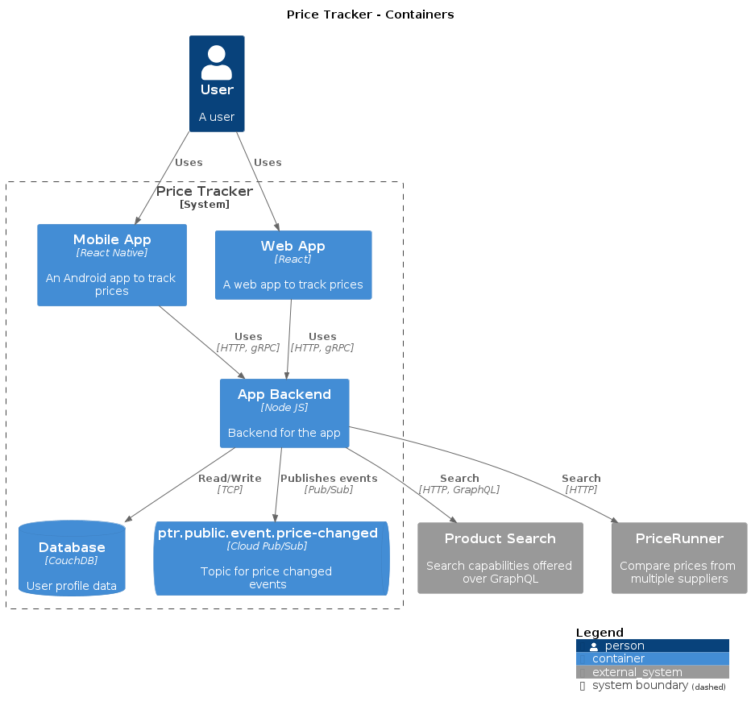

# structurizr-to-png

Create PNGs from [Structurizr DSL](https://github.com/structurizr/dsl#readme) files.

This project uses [PlantUML](https://plantuml.com) and the [C4-PlantUML macros](https://github.com/plantuml-stdlib/C4-PlantUML)
to render Structurizr DSL to PNG images. It performs some processing in the intermediate steps to support conventions around external C4 elements and rendered shapes.

## Features

  * Create PNGs from DSL files
  * Live preview of PNGs in your browser

# Usage

The project is intended to be used locally while authoring diagrams and in build pipelines workflows to automatically update diagrams in the source repository and READMEs.

## :whale: Docker

```bash
$ docker run --rm -it -v $(pwd):/docs extenda/structurizr-to-png
```

The convention is to generate diagrams to an `images/` directory inside the working directory. The default working directory used in the container is `/docs`. The above command will render all `*.dsl` files in the current working directory and it's subdirectories.

To render particular dsl files, use the `--path` option (glob is supported). Relative paths are treated from DSL file directory.

```bash
$ docker run --rm -it -v $(pwd):/docs extenda/structurizr-to-png --path workspace.ecd.dsl
```

To change the default output location, use the `--output` option. If specified as a relative path, it is resolved from DSL file directory.

```bash
$ docker run --rm -it -v $(pwd):/docs extenda/structurizr-to-png --output c4-diagrams
```

The above example will write files to the `c4-diagrams` directory in the current working directory.

### Live preview in browser

To use the live preview functionality, we must add the `--watch` flag and a port binding.

```bash
$ docker run --rm -it -v $(pwd):/docs -p 3000:3000 extenda/structurizr-to-png --watch
```

Open https://localhost:3000 in your browser to see the preview images. The images will update when the DSL is changed.
<!--
## :octocat: GitHub Action

Given that you have the following file tree:

```
docs
├── system1
│   └── system1.dsl
└── system2
    └── system2.dsl
```

An action configured to run from the `docs` directory will produce PNGs for all DSL files.
If the action detects changes to the images it will commit the updates using the `github-token`.

```yaml
name: structurizr
on:
  push:
    paths: 'docs/*.dsl'

jobs:
  structurizr:
    runs-on: ubuntu-latest
    steps:
      - uses: actions/checkout@v2

      - uses: extenda/structurizr-to-dsl@v0
        with:
          working-directory: docs
          github-token: ${{ secrets.GITHUB_TOKEN }}
```
-->

# Examples

The examples are created from [demo.dsl](demo.dsl).

## System context



## Containers


# :balance_scale: License

This project is licensed under the [MIT license](LICENSE).
